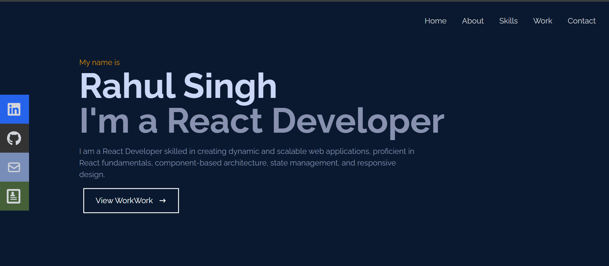

# Portfolio Website

## Introduction

Welcome to my Portfolio Website! This website serves as a showcase of my skills, projects, and experiences. It provides an overview of who I am and what I can offer as a developer.

Visit the live website: [Portfolio Website](https://rsingh1996.github.io/portfolio-website/)

## Features

- Clean and responsive design for optimal viewing on various devices.
- Overview of my skills, projects, and experiences.
- Direct links to my GitHub repositories and social profiles.
- Contact form for easy communication.

## Technologies Used

- HTML
- CSS
- JavaScript
- Tailwind CSS
- React JS

## How to Explore

1. Visit the [Portfolio Website](https://rsingh1996.github.io/portfolio-website/).
2. Explore the different sections to learn more about my skills, projects, and experiences.
3. Check out the direct links to my GitHub repositories and other social profiles.
4. Use the contact form to get in touch with me.

## Contributing

Contributions to my portfolio are not expected. However, if you notice any issues or have suggestions for improvements, please feel free to [open an issue](https://github.com/rsingh1996/portfolio-website/issues) on this GitHub repository.

## License

## Acknowledgments

- Special thanks to Dev Community
